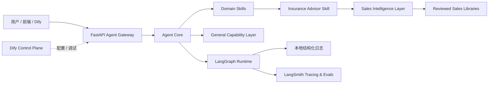

# 保险顾问生产级 Agent Framework

本项目将一个基于 Dify 的保险/金融销售沟通教练，改造成“生产级 Agent Framework + 保险顾问垂直 Skill + Sales Intelligence Layer 销售实战智能层”的完整工程骨架。

它不是一个大 Prompt，不是纯 Dify 机器人，也不是简单 tool calling demo。项目目标是把通用 Agent 能力、垂直业务能力、销售采访语料资产化、可观测性、评估体系、安全合规和失败恢复拆成清晰模块，形成可维护、可扩展、可面试讲解的生产级架构。

## 项目定位

当前业务场景是“保险顾问 / 高客沟通教练 / 破冰助手”，但底层设计是通用 Agent Framework：

- 保险顾问只是第一个 `Domain Skill`；
- 未来可扩展研究助手、文档分析助手、面试助手、销售助手、客服助手、数据分析助手；
- 一线销售采访语料不是普通知识库文档，而是沉淀为 `Sales Intelligence Layer`；
- Dify 作为 Control Plane，FastAPI + LangGraph + Agent Core 作为 Data Plane；
- LangSmith 作为可观测性和评估增强层，本地结构化日志始终可用。

## 为什么不是简单 Prompt 工程

原 Dify 工作流已经有有价值的业务 Prompt：KYC 采集、从业者画像、客户画像、路由评分、新闻素材、合规话术等。但生产级 Agent 还需要：

- 显式状态机，而不是隐藏在 Prompt 里的流程；
- 类型化输入/输出契约，模型输出进入下游前必须校验；
- 工具 schema、权限、超时、重试、错误结构和审计日志；
- RAG source boundary，外部资料只能作为证据，不能改写系统规则；
- 销售采访语料结构化为卡片、策略库、话术库、异议库、评估集；
- 本地结构化日志，LangSmith 不可用时主业务仍能运行；
- Eval 数据集和可重复质量门禁；
- Guardrails、Human-in-the-loop、Recovery、Cost Control。

## 技术栈

- Python 3.11+
- Pydantic v2：数据契约和 schema 校验
- FastAPI：Agent Gateway adapter
- LangGraph：状态机和 workflow runtime adapter
- LangSmith：可选 tracing / evaluation / experiment
- Dify：可视化 Control Plane
- 自定义 Agent Core：路由、工具、RAG、Memory、Context、Guardrails、Recovery、Cost、Domain Skill 管理

当前本地环境没有安装 FastAPI，因此 API server 已实现为 adapter-ready，启动服务前需要安装可选依赖：

```bash
pip install -e ".[api]"
```

限制说明见：[docs/known-limitations.md](docs/known-limitations.md)

## 总体架构



## 快速开始

最推荐先跑本地演示：

```bash
python3 main.py
```

只测试一条输入：

```bash
python3 main.py --message "客户喜欢银行理财，我怎么破冰"
```

进入交互模式：

```bash
python3 main.py --interactive
```

运行单元测试：

```bash
python3 -m pytest
```

运行本地评估集：

```bash
python3 evals/run_evals.py
```

启动生产依赖并执行数据库迁移：

```bash
cp .env.example .env
docker compose up -d postgres redis
set -a; source .env; set +a
make db-upgrade
```

生产模型与外部工具需要在 `.env` 中配置：

- `LLM_BASE_URL` / `LLM_API_KEY` / `DEFAULT_CHAT_MODEL`
- `EMBEDDING_BASE_URL` / `EMBEDDING_API_KEY` / `EMBEDDING_MODEL`
- `RERANKER_BASE_URL` / `RERANKER_API_KEY` / `RERANKER_MODEL`
- `WEATHER_API_URL`、`WEB_SEARCH_API_URL`、`NEWS_SEARCH_API_URL`、`FILE_PARSER_API_URL` 等工具 provider

未配置 provider 的模型节点或外部工具会明确报错并进入恢复/审批链路，不会返回本地伪结果。

安装 FastAPI 后启动 API：

```bash
pip install -e ".[api]"
uvicorn agent_core.api.server:app --reload
```

## 目录总览

- `configs/`：Agent、状态机、工具、RAG、Guardrails、LangSmith、成本预算等运行配置。
- `src/agent_core/api/`：FastAPI Agent Gateway 适配层。
- `src/agent_core/graph/`：LangGraph 状态机、节点、边、checkpoint。
- `src/agent_core/workflow/`：workflow 输入输出契约和执行引擎。
- `src/agent_core/tools/`：工具系统，包含工具 schema、注册表、权限、路由。
- `src/agent_core/capabilities/`：通用能力层，例如时间、计算器、搜索、文件解析、翻译、总结等。
- `src/agent_core/sales_intelligence/`：销售实战智能层，负责访谈语料加工、卡片、检索、合规、评估生成。
- `src/agent_core/skills/insurance_advisor/`：保险顾问垂直业务 Skill。
- `src/agent_core/guardrails/`：输入、输出、工具、人工审批等安全合规模块。
- `src/agent_core/observability/`：本地日志、trace、LangSmith adapter、metrics。
- `src/agent_core/evals/`：评估器和 LangSmith eval adapter。
- `dify/`：Dify Control Plane workflow 和节点职责说明。
- `evals/`：本地 eval 数据集和运行入口。
- `tests/`：单元测试。
- `docs/`：架构、状态机、RAG、Guardrails、Sales Intelligence、Dify、LangSmith、面试讲解等文档。

完整文件级说明见：[docs/project-structure.md](docs/project-structure.md)

如果你看不懂项目、无从下手，先看：[docs/start-here.md](docs/start-here.md)

业务记忆系统设计见：[docs/memory-system.md](docs/memory-system.md)

PostgreSQL 生产落地 DDL 见：[docs/database-schema.sql](docs/database-schema.sql)

完整对话链路说明见：[docs/conversation-flows.md](docs/conversation-flows.md)

请求进入 Agent 后的完整流程图见：[docs/request-lifecycle-flowchart.md](docs/request-lifecycle-flowchart.md)

生产级检查表逐项对照见：[docs/production-readiness-checklist.md](docs/production-readiness-checklist.md)

注释与日志规范见：[docs/logging-and-comments-policy.md](docs/logging-and-comments-policy.md)

## Sales Intelligence Layer

本项目把一线销售采访语料视为核心业务资产，而不是普通 RAG 文档。

处理链路：

1. 原始访谈归档；
2. 敏感信息脱敏；
3. 清洗转写稿；
4. 按销售场景切片；
5. 抽取结构化销售洞察卡片；
6. 合规审查和人工抽样审核；
7. 写入 KYC 问题库、破冰库、案例库、异议处理库、计划书成交库、话术模板库；
8. 检索时只检索已审核卡片，不直接把原始访谈塞进 Prompt；
9. 压缩成 `sales_insight_digest` 后再交给生成节点；
10. 从高频销售问题生成 eval cases。

核心文档：

- [docs/sales-intelligence-layer.md](docs/sales-intelligence-layer.md)
- [docs/interview-processing.md](docs/interview-processing.md)
- [docs/sales-corpus-usage.md](docs/sales-corpus-usage.md)

## Dify 集成方式

Dify 保留为 Control Plane：

- 管理 Prompt；
- 配置可视化 Workflow；
- 做内部运营调试；
- 通过 HTTP 节点调用 FastAPI Agent Core；
- 不承担公网高并发、鉴权、限流、多租户、成本预算和恢复逻辑。

文档见：[docs/dify-integration.md](docs/dify-integration.md)

## LangSmith 集成方式

LangSmith 是增强层，不是强依赖。通过环境变量控制：

- `LANGSMITH_TRACING`
- `LANGSMITH_API_KEY`
- `LANGSMITH_PROJECT`
- `LANGSMITH_ENDPOINT`

当 LangSmith 不可用或未配置 API Key 时，系统自动降级到本地结构化日志。

文档见：[docs/langsmith-integration.md](docs/langsmith-integration.md)

## 测试和评估

测试：

```bash
python3 -m pytest
```

本地 eval：

```bash
python3 evals/run_evals.py
```

当前 eval 数据集：[evals/dataset.jsonl](evals/dataset.jsonl)

## 如何扩展

新增通用工具：

1. 在 `src/agent_core/tools/schemas.py` 中遵循 `ToolSpec` 契约；
2. 在 `src/agent_core/capabilities/` 下实现工具 adapter；
3. 在 `ToolRegistry` 注册；
4. 补充工具权限、guardrail 和测试。

新增 Domain Skill：

1. 在 `src/agent_core/skills/<skill_name>/` 下创建 skill；
2. 添加 `skill.yaml`、workflow、prompts、README；
3. 接入 Agent Core 的 router、context、guardrails、eval；
4. 不把通用能力写死在业务 Skill 内。

新增销售访谈语料：

1. 通过 `sales_intelligence.ingestion` 接入原始语料；
2. 走脱敏、清洗、切片、抽取、合规审查；
3. 只把审核后的卡片设为 `approved_for_generation=true`；
4. 从高频问题生成 eval case。

## 面试讲解入口

推荐从以下文档开始：

- [docs/start-here.md](docs/start-here.md)
- [docs/conversation-flows.md](docs/conversation-flows.md)
- [docs/interview-guide.md](docs/interview-guide.md)
- [docs/architecture.md](docs/architecture.md)
- [docs/state-machine.md](docs/state-machine.md)
- [docs/project-structure.md](docs/project-structure.md)
