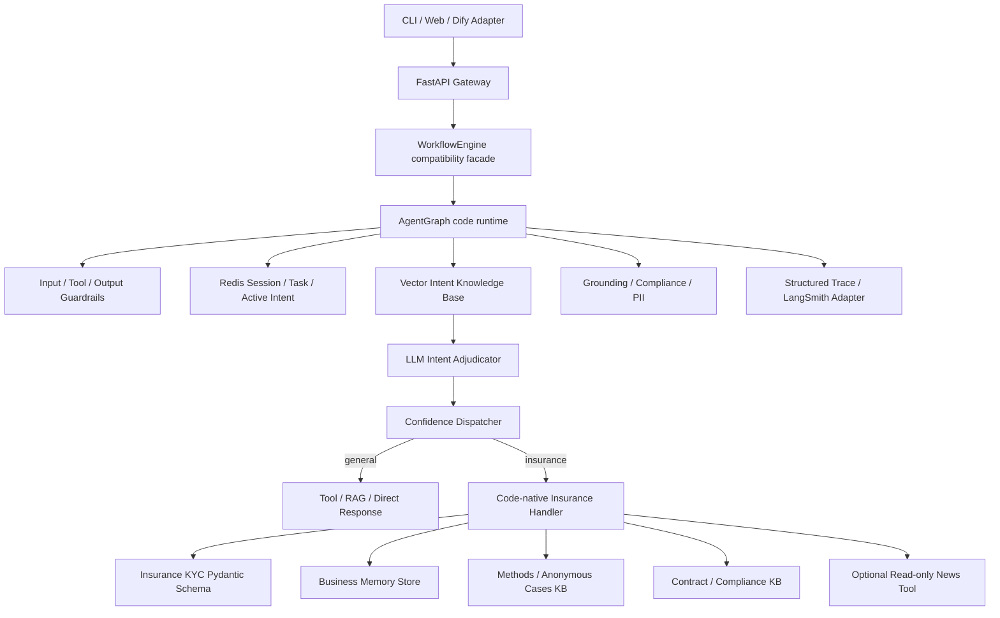

# 架构设计

项目采用显式状态机驱动的单 Agent 混合架构。外层 Python 控制顺序、安全和状态；模型当前参与灰区
语义裁定与保险 KYC 事实抽取。通用回答和保险策略现阶段使用可测试的确定性生成器，真实生成模型端点
已预留但尚未成为默认执行路径。

## 层级职责

- Gateway：鉴权、租户绑定、限流、请求上限和隐私接口；
- AgentGraph：确定性节点顺序、状态转移、恢复和最终收敛；
- Intent Layer：活跃意图、漂移检测、向量 TopK、LLM 裁定和置信度分发；
- General Capability：Tool Schema、权限、副作用检查、执行和结果校验；
- Insurance Handler：领域 KYC、业务记忆、双知识库、新闻清洗和策略生成；
- Guardrails：输入、工具、输出和 PII；高风险同步阻断或降级；
- Observability：不含 PII 和隐藏推理链的结构化 Trace。

Dify 可继续调用 HTTP API 或管理离线 Prompt，但不再承载保险运行逻辑。完整流程见
[request-lifecycle-flowchart.md](request-lifecycle-flowchart.md)。
