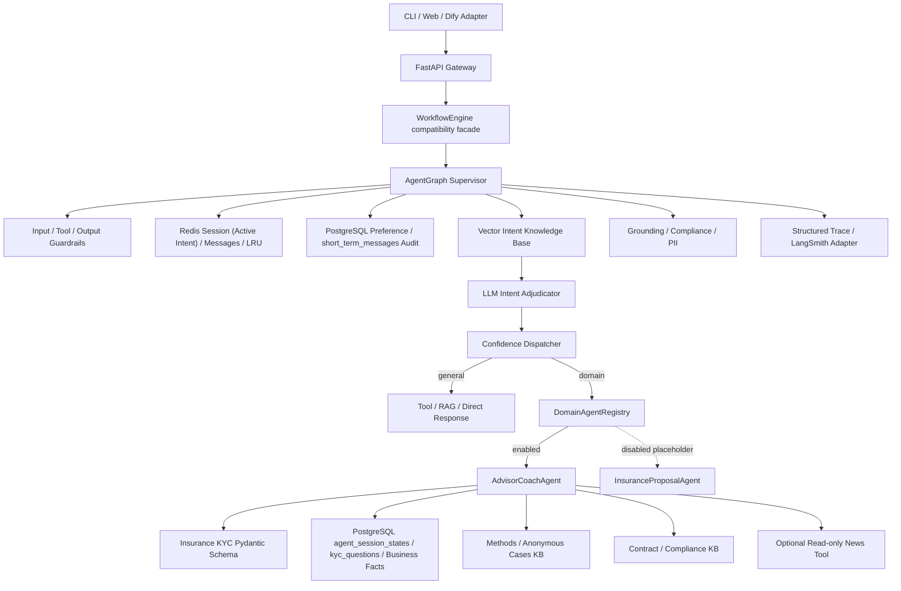

# 架构设计

项目采用“显式状态机总控 + 专业 Agent Registry”的混合架构。外层 Python 控制顺序、安全和状态；
`DomainAgentRegistry` 按已裁定的 `intent + domain_skill` 精确选择专业 Agent。模型当前参与灰区语义
裁定与保险 KYC 事实抽取。通用回答和保险策略现阶段使用可测试的确定性生成器，真实生成模型端点已
预留但尚未成为默认执行路径。

## 层级职责

- Gateway：鉴权、租户绑定、限流、请求上限和隐私接口；
- AgentGraph Supervisor：公共安全入口、会话恢复、意图识别、通用路径和最终收敛；
- DomainAgentRegistry：按领域与意图白名单选择已启用 Agent，拒绝未启用占位能力；
- AdvisorCoachAgent：领域 KYC、业务记忆、双知识库、新闻清洗和沟通策略；
- InsuranceProposalAgent：当前只有默认禁用占位和版本化任务/Artifact 契约，不影响现有运行；
- Intent Layer：活跃意图、漂移检测、向量 TopK、LLM 裁定和置信度分发；
- General Capability：Tool Schema、权限、副作用检查、执行和结果校验；
- Guardrails：输入、工具、输出和 PII；高风险同步阻断或降级；
- Observability：不含 PII 和隐藏推理链的结构化 Trace。

Dify 可继续调用 HTTP API 或管理离线 Prompt，但不再承载保险运行逻辑。完整流程见
[request-lifecycle-flowchart.md](request-lifecycle-flowchart.md)。
