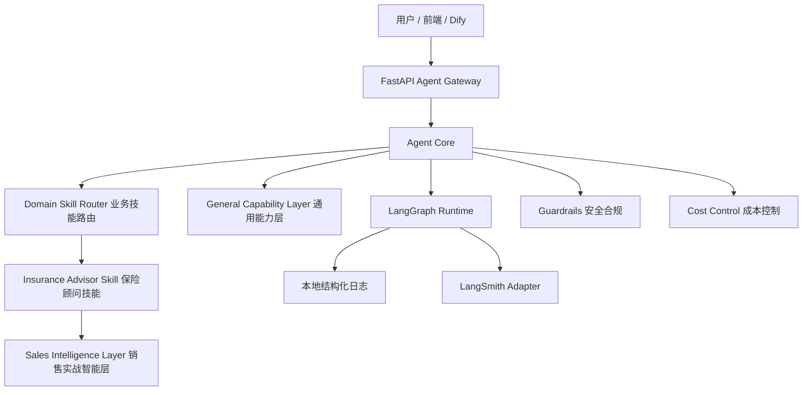

# 架构设计

本项目采用 Control Plane / Data Plane 分离架构。

## 各层职责

- `FastAPI Agent Gateway`：负责公网入口、请求校验、鉴权、限流、租户隔离、trace id 注入。
- `LangGraph Runtime`：负责显式状态机、节点执行、状态流转和未来 checkpoint/recovery。
- `Agent Core`：负责意图路由、工具系统、RAG、Memory、Context、Guardrails、Recovery、Cost Control。
- `Domain Skill`：负责垂直业务逻辑，当前第一个 Skill 是保险顾问。
- `Sales Intelligence Layer`：负责销售访谈语料加工、结构化卡片、检索、合规审查、评估生成。
- `Dify Control Plane`：负责可视化配置、Prompt 管理、内部调试，不承担生产主入口职责。
- `LangSmith`：负责可选 trace、dataset、evaluation、experiment，本地日志仍是基础保障。

## 为什么这样拆

如果所有逻辑都写进一个 Prompt，后续很难排查问题，也无法做权限、状态恢复、成本预算和评估。当前拆法让每层边界清楚：业务 Skill 可以换，工具 provider 可以换，RAG 后端可以换，但 Agent Core 的运行契约保持稳定。

