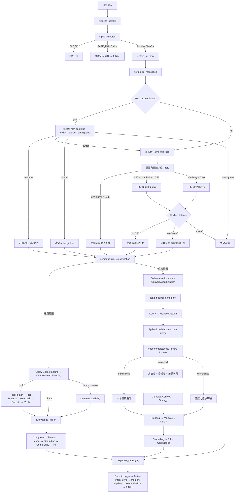

# 请求全生命周期

当前所有请求都进入同一份 Python 代码：

```text
AgentRunRequest
→ WorkflowEngine.run()
→ AgentGraph.invoke()
→ AgentState
→ AgentRunResponse（内部）
→ PublicAgentRunResponse（FastAPI 客户接口）
```

保险不再通过 `workflow_name` 选择 Dify/KYC 工作流。`workflow_name` 仅保留请求兼容标签，真正路由由
Redis 活跃意图、向量意图知识库和 LLM 语义裁定共同决定。

## 总流程



## 1. 初始化和输入风控

`initialize_context` 创建 Trace、预算和用户消息。`input_guardrail` 在 Memory、向量检索、LLM、RAG
和工具之前运行，保证高相似意图也不能绕过安全层。

输入动作只有：

```text
ALLOW         正常继续
MASK          脱敏后继续
SAFE_FALLBACK 不执行原动作，同步返回安全替代说明
BLOCK         终止请求
```

系统面向客户渠道，不存在人工审批或挂起状态。

## 2. 恢复 Redis 活跃意图

Session Memory 中的 `active_intent` 只保存控制状态：

```json
{
  "intent": "insurance_break_ice",
  "status": "active",
  "confidence": 0.94,
  "source": "llm_candidate_adjudication",
  "pending_focus": "children_count",
  "asked_focuses": ["customer_role", "children_count"],
  "started_at": "UTC ISO",
  "updated_at": "UTC ISO",
  "expires_at": "UTC ISO"
}
```

家庭、资产和保险事实不写入该 Redis 信封，而是进入版本化、带 evidence、受 RLS 与 Consent 保护的
业务记忆 Store。用户原文和 evidence 加密；规范化事实值与 Session 快照当前仍是 JSONB，详见
[memory-system.md](memory-system.md#加密rls-和隐私治理)。
`expires_at` 是独立业务 TTL；即使普通 Session 仍在，过期保险任务也不能继续劫持新输入。

活跃意图存在时先调用小模型：

- `continue`：用户正在回答上一轮问题，跳过全局向量意图识别；
- `switch`：重新走完整双层意图识别；只有新意图达到执行阈值后才替换旧状态；
- `cancel`：结束当前保险信息收集；
- `ambiguous`：询问用户继续旧任务还是换题。

模型不可用时只对明确停止词、明确跨域问题和短回答使用保守代码判断。
如果换题判断成立但新意图置信度不足，系统返回澄清并标记 `switch_pending`，不会先删除仍可恢复的旧
active intent。

## 3. 向量 + LLM 双层意图路由

第一层从 `intent_catalog` 知识库召回 TopK。生产使用 pgvector 的纯 `vector_score`；本地使用字符
n-gram 稀疏向量余弦，仅用于确定性测试。

```text
score >= 0.85        高频固定意图，直接路由
0.60 <= score <0.85 候选意图交 LLM 裁定
score < 0.60         新表达交 LLM 开放集裁定
```

开放集不表示允许 LLM 创造可执行意图。模型仍只能从 `configs/intent_catalog.yaml` 白名单输出。

第二层根据结构化 `confidence` 做执行度判断：

```text
confidence >= 0.80        直接分发
0.60 <= confidence <0.80 分发，并写 medium_confidence_intent_routed
confidence < 0.60         主动澄清，不执行工具或保险 Handler
```

这些阈值是当前初始配置，不是跨 Embedding/模型通用常数。上线必须使用真实验证集按模型版本校准。

## 4. 通用意图

通用意图继续执行：

```text
semantic_risk_classification
→ query_understanding
→ context_need_planning
→ tool / direct / future domain
→ knowledge_fusion
→ compress_context
→ prompt_assembly
→ model_routing
→ generate_response
→ grounding_verification
→ compliance_review
→ output_pii_scan
→ bounded evaluator-optimizer
→ response_packaging
→ memory update
```

工具参数不使用全局槽位。选中工具后直接按该工具 `input_schema` 校验；缺参则在执行器前澄清。

## 5. 代码化保险 Handler

当前白名单保险意图包括：

- `insurance_break_ice`
- `insurance_objection_handling`
- `insurance_strategy`
- `insurance_kyc_collection`

进入后顺序如下：

```text
load_business_memory
→ extract_insurance_kyc_slots
→ merge_kyc_delta
→ analyze_kyc_and_route
→ status_router
→ one gentle question / dual-KB strategy / low-pressure strategy
→ propose / validate / persist shown result
→ grounding / PII / compliance
→ packaging / output logger / active-intent sync
```

LLM 只抽取本轮明确事实，不计算完整度、机会分、轮次和状态。字段类型、合并、空值保护、明确更正、
评分、最大轮次和路由全部由 Python 控制。

领域 KYC 主要字段：

```text
insurance_experience
customer_role
family_structure / children_count
decision_authority / family_consensus_required
available_long_term_funds / liquid_asset_band
active_asset_types
relationship_stage / contact_scene
primary_concern / insurance_feedback
```

不同细分意图使用不同核心字段集，不要求破冰阶段一次采集所有信息。信息不足时每轮只选择一个尚未
问过的焦点。默认最多三轮，达到上限或用户要求“先给策略”后，基于已有信息生成初版策略。

## 6. 双知识库和新闻

信息达到可行动状态后，代码生成不含 PII 的检索 Query，然后分别检索：

1. `insurance_methods`：沟通方法和匿名案例；
2. `insurance_compliance`：合同、利益说明和合规边界。

两者使用独立 library、TopK 和阈值，结果在 Compact Context 中保持独立，避免把案例建议当成合同事实。

只有 `objective_material_need` 非空时才调用 `news_search`。外部新闻在 Python 中去 HTML、按触发模块和
客户关注点打分、取 Top5，并保留标题、来源、日期和摘要。工具失败时明确写入“不得编造事实”的降级说明。

## 7. 输出和记忆

保险问题、低压策略和完整策略统一经过：

```text
grounding_verification
→ output_pii_scan
→ compliance_review
→ response_packaging
→ post_response_logger
→ sync_active_intent_state
→ update_short_term_memory
→ trace_finalize
```

内部 `AgentRunResponse` 保留意图来源、Top1 分、置信度、执行档位、候选分数与完整 Trace，供测试和
服务端诊断。客户 HTTP 使用 `PublicAgentRunResponse`，只返回答案、Trace ID、脱敏引用 ID、
`active_intent` 控制信封、KYC 状态摘要、下一步、警告和澄清问题；不返回知识正文或工具/Trace 细节。

Trace 只记录槽位名、命中数量、来源 ID 和分数，不记录家庭/资产槽位原值或模型思维链。
