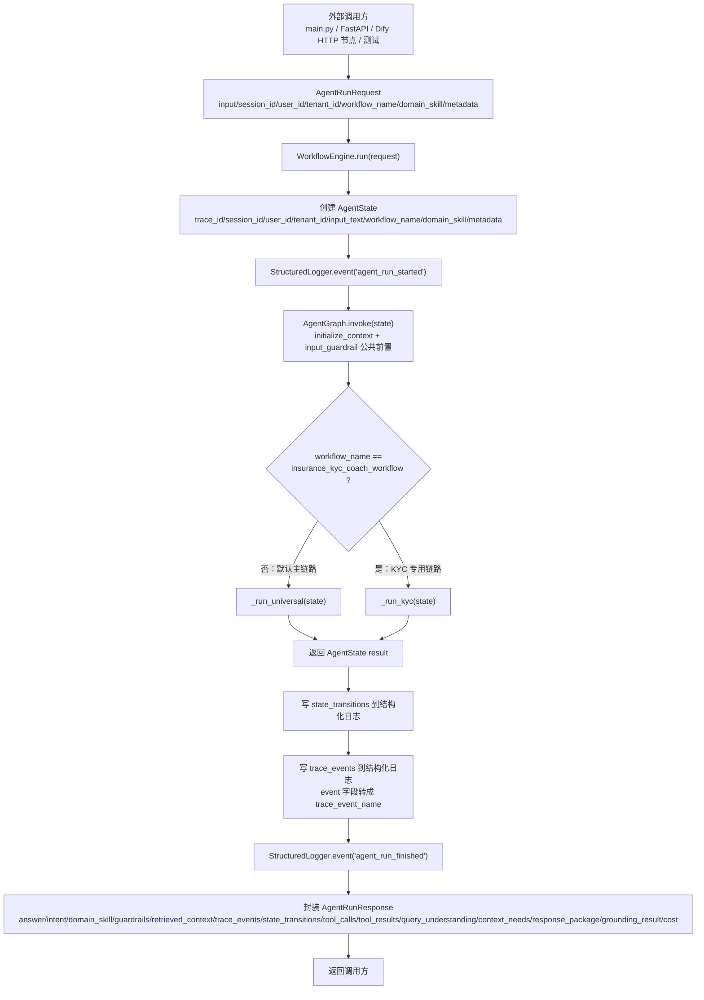
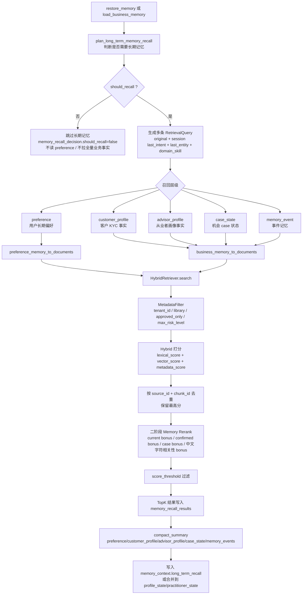
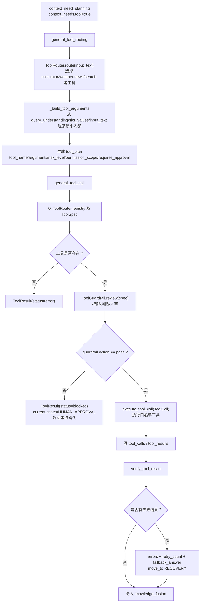
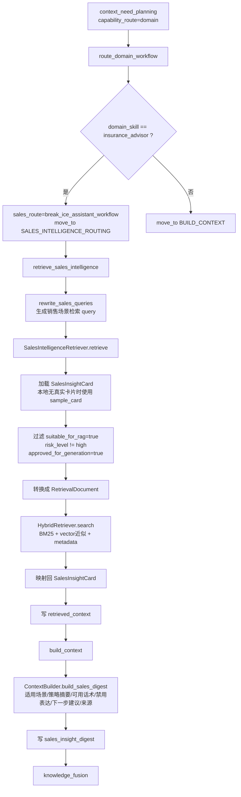
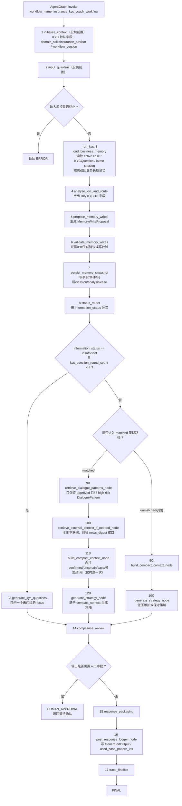
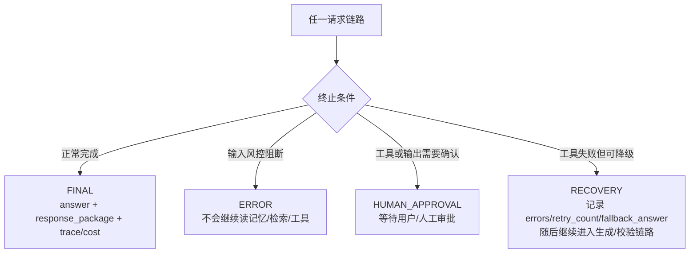

# Agent 请求全链路流程图

本文档整理“一个请求进入 Agent 后，程序内部完整怎么流转”。

当前所有请求都从同一个入口进入：`WorkflowEngine.run()` → `AgentGraph.invoke()`（见 `src/agent_core/graph/builder.py`）。`AgentGraph` 采用线性顺序写法，在 `initialize_context` + `input_guardrail` 之后按 `workflow_name` 分叉成两条内部链路：

1. 默认通用 Agent 主链路（`_run_universal`）：`workflow_name != insurance_kyc_coach_workflow`；
2. 保险 KYC 教练专用链路（`_run_kyc`）：`workflow_name == insurance_kyc_coach_workflow`。

两条链路共享 `WorkflowEngine.run()`、`AgentGraph`、`AgentState`、结构化日志、状态迁移和最终 `AgentRunResponse`。

## 0. 竖向主链路总览

下面这版是你要的“一个请求进来后，从上到下怎么走”的形式。

注意：你给的草稿里 `Context Need 判断` 放在 `Query Understanding` 前面。当前项目真实实现是先做 `Query Understanding`，再做 `Context Need 判断`。原因是 `Context Need` 需要用到已经解析出来的实体、时间范围、检索 filters、工具参数等信息。

```text
用户输入
  ↓
Request 接入
  - main.py / FastAPI / Dify HTTP 节点 / 单元测试
  - 外部请求统一封装为 AgentRunRequest
  ↓
WorkflowEngine.run()
  - 创建 AgentState
  - 生成 trace_id
  - 写入 session_id / user_id / tenant_id
  - 写入 input_text / workflow_name / domain_skill / metadata
  - 记录 agent_run_started 日志
  ↓
AgentGraph.invoke()
  - initialize_context（初始化 trace/预算/消息）
  - input_guardrail（输入安全检查，命中即安全终止返回 ERROR）
  ↓
按 workflow_name 分叉
  ├── workflow_name != insurance_kyc_coach_workflow
  │     ↓
  │   _run_universal：默认通用 Agent 主链路
  │
  └── workflow_name == insurance_kyc_coach_workflow
        ↓
      _run_kyc：保险 KYC 教练专用链路
```

> 说明：`initialize_context` 和 `input_guardrail` 是两条链路的公共前置步骤，只执行一次；下面 0.1 / 0.2 为便于逐步阅读仍各自从这两步写起。

### 0.1 默认通用 Agent 主链路

```text
AgentState
  ↓
1. Agent Context 初始化
   - initialize_context
   - 建立 trace、成本预算、用户消息
   - 写入 messages / cost / trace_events
  ↓
2. 输入安全检查
   - input_guardrail
   - 检查 Prompt Injection / 越权指令 / 明显违规请求
  ↓
是否被输入风控阻断？
  ├── 是
  │     ↓
  │   ERROR
  │   - 写入安全阻断 answer
  │   - 不再读取记忆
  │   - 不再 RAG
  │   - 不再调用工具
  │   - 返回 AgentRunResponse
  │
  └── 否
        ↓
3. 短期记忆读取 + 长期记忆按需召回
   - restore_memory
   - 每轮读取 session memory
   - 每轮读取 task memory
   - preference 长期记忆不是每轮读取
   - 先做 plan_long_term_memory_recall
   - 需要时才对 preference 做 hybrid search + rerank
   - 写入 memory_context
   - 写入 memory_recall_decision
   - 写入 memory_recall_results
  ↓
4. 消息标准化与多轮上下文合并
   - normalize_messages
   - 合并 session recent_messages
   - 追加本轮 user input
   - 过滤非对话事件
  ↓
5. Router 意图识别
   - classify_intent
   - 识别 weather_query
   - 识别 calculator_query
   - 识别 web_or_news_search
   - 识别 insurance_advisor_help
   - 识别 general_chat
   - 写入 intent / capability_route / domain_skill
  ↓
6. 语义风险分级
   - semantic_risk_classification
   - 输出 low / medium / high
   - 高风险影响工具、人审、输出审查
  ↓
7. 槽位抽取
   - extract_slots
   - 抽取客户类型、家庭情况、资产偏好
   - 抽取公司实体
   - 抽取语言要求
   - 抽取新闻/融资主题
   - 从 session memory 做简单指代消解准备
  ↓
8. 槽位检查 / 澄清判断
   - validate_slots
   - 检查 customer_profile 等关键字段是否缺失
   - 写入 missing_slots
   - 写入 clarification_required
  ↓
9. Query Understanding
   - query_understanding
   - 指代消解
   - 时间解析
   - 实体抽取
   - Query Rewrite
   - 检索 filters 生成
   - 例如 language=en / source_type=news / date_range / entity / topic
  ↓
10. Context Need 判断
    - context_need_planning
    - 判断本轮是否需要：
      - memory
      - long_term_memory
      - RAG
      - Tool
      - Human
      - Reject
      - Clarify
  ↓
11. 主路由分支
    ├── 需要 Tool
    │     ↓
    │   11A. Tool Planning
    │       - general_tool_routing
    │       - ToolRouter 选择 calculator / weather / web_search / news_search 等
    │       - 构造最小工具参数
    │       - 生成 tool_plan
    │     ↓
    │   12A. Tool 权限网关
    │       - general_tool_call 内部执行 ToolGuardrail
    │       - 检查 permission_scope
    │       - 检查 risk_level
    │       - 检查 requires_approval
    │     ↓
    │   是否需要人工审批？
    │       ├── 是
    │       │     ↓
    │       │   HUMAN_APPROVAL
    │       │   - 停止自动执行
    │       │   - 返回等待确认
    │       │
    │       └── 否
    │             ↓
    │   13A. Tool Execution Loop
    │       - execute_tool_call
    │       - 写入 tool_calls
    │       - 写入 tool_results
    │       - 当前实现是顺序执行工具计划
    │       - 后续可扩展多轮工具循环
    │     ↓
    │   14A. Tool Result 校验 / Retry / Recovery
    │       - verify_tool_result
    │       - 检查 status 是否 success
    │       - 失败写入 errors
    │       - 增加 retry_count
    │       - 必要时 fallback_answer
    │       - 可进入 RECOVERY
    │     ↓
    │   进入结果融合
    │
    ├── 需要 Domain Skill / RAG
    │     ↓
    │   11B. Domain Workflow Routing
    │       - route_domain_workflow
    │       - insurance_advisor 进入 Sales Intelligence
    │     ↓
    │   12B. RAG Query Rewrite
    │       - retrieve_sales_intelligence 内部执行 rewrite_sales_queries
    │       - 生成销售场景检索 query
    │     ↓
    │   13B. RAG Retrieval
    │       - SalesIntelligenceRetriever.retrieve
    │       - 只加载结构化 SalesInsightCard
    │       - 不直接检索原始销售访谈全文
    │     ↓
    │   14B. Metadata Filter
    │       - suitable_for_rag=true
    │       - approved_for_generation=true
    │       - risk_level != high
    │     ↓
    │   15B. Hybrid Search
    │       - HybridRetriever
    │       - BM25 / lexical score
    │       - vector 近似分
    │       - metadata score
    │     ↓
    │   16B. Rerank / Filter
    │       - combine_scores
    │       - TopK
    │       - 映射回 SalesInsightCard
    │     ↓
    │   17B. Context Builder
    │       - build_context
    │       - ContextBuilder.build_sales_digest
    │       - 生成 sales_insight_digest
    │     ↓
    │   进入结果融合
    │
    └── 不需要 Tool / Domain RAG
          ↓
        直接进入结果融合
  ↓
18. Knowledge Fusion / 结果融合
    - knowledge_fusion
    - 合并 memory_context
    - 合并 retrieved_context
    - 合并 sales_insight_digest
    - 合并 tool_results
    - 合并 normalized_messages
    - 预留 conflicts
  ↓
19. Context Compression
    - compress_context
    - 压缩 sales evidence
    - 压缩 tool digest
    - 保留 memory
    - 保留 query_understanding
    - 写入 compressed_context
    - 写入 compressed_context_chars
  ↓
20. Prompt Assembly
    - prompt_assembly
    - 组装 system
    - 组装 memory
    - 组装 context
    - 组装 user
    - 保留 source_boundary
  ↓
21. Model Routing
    - model_routing
    - 根据 domain_skill / risk_level / budget_pressure 选择模型名
  ↓
22. LLM Reasoning / 本地生成
    - generate_response
    - 本地 deterministic 实现
    - 工具类问题优先使用 tool_results
    - 保险顾问问题使用销售洞察摘要
    - 普通问题给保守回答
  ↓
23. Grounding / Verification
    - grounding_verification
    - 检查是否有 RAG / Tool / Domain Skill 依据
    - 生成 evidence_sources
    - 记录 conflicts
  ↓
24. Output Guardrail
    - compliance_review
    - 检查保证收益、恐吓营销、违规承诺、敏感信息泄露
  ↓
输出是否需要人工审批？
  ├── 是
  │     ↓
  │   HUMAN_APPROVAL
  │   - 返回等待人工确认
  │
  └── 否
        ↓
25. Response Packaging
    - response_packaging
    - 封装 answer
    - 封装 citations
    - 封装 tool_cards
    - 封装 next_actions
    - 封装 risk_level
    - 封装 trace_id
  ↓
26. Short-term Memory Update
    - update_short_term_memory
    - 写 recent_messages
    - 写 last_intent
    - 写 last_answer
    - 写 slot_values
    - 写 last_entity
  ↓
27. Long-term Memory Candidate
    - long_term_memory_candidate
    - 判断哪些偏好或画像值得长期保存
    - 当前写入 preference memory 候选
  ↓
28. Trace / Cost Finalize
    - trace_finalize
    - 写 output_chars
    - 写 trace_event_count
    - 写 final trace
  ↓
FINAL
  ↓
WorkflowEngine.run 收尾
  - 写 state_transitions 日志
  - 写 trace_events 日志
  - 写 agent_run_finished 日志
  - 封装 AgentRunResponse
  ↓
返回用户
```

### 0.2 保险 KYC 教练专用主链路

```text
用户输入
  ↓
AgentRunRequest(workflow_name="insurance_kyc_coach_workflow")
  ↓
WorkflowEngine.run() → AgentGraph.invoke()
  ↓
1. Agent Context 初始化（公共前置）
   - initialize_context
  ↓
2. 输入安全检查（公共前置）
   - input_guardrail
  ↓
是否被阻断？
  ├── 是 → ERROR → 返回
  └── 否（进入 AgentGraph._run_kyc）
        ↓
3. 业务记忆读取 / 工作流状态恢复
   - load_business_memory
   - 读取 active OpportunityCase
   - 读取 KYCQuestion 已问焦点
   - 读取 latest AgentSessionState
   - 长期客户事实 / 顾问事实 / case 事件按需召回
   - hybrid search + rerank 后合并到 profile_state / practitioner_state
  ↓
4. KYC 分析与路由
   - analyze_kyc_and_route
   - 产出 Dify KYC 18 个字段
   - 判断 information_status
   - 执行最多 4 轮补问规则
  ↓
5. Memory Write Proposal
   - propose_memory_writes
   - 生成 facts_to_upsert
   - 生成 events_to_insert
   - 生成 questions_to_record
   - 生成 session_state_to_insert
   - 生成 analysis_run_to_insert
  ↓
6. Memory Write Validator
   - validate_memory_writes
   - 检查 evidence_text
   - 检查 source_type
   - 阻断 PII
   - 阻断把模型建议写成客户事实
  ↓
7. Persist Memory Snapshot
   - persist_memory_snapshot
   - 写入 CustomerProfileFact / AdvisorProfileFact
   - 写入 MemoryEvent
   - 写入 KYCQuestion
   - 写入 AgentSessionState
   - 写入 AnalysisRun
   - 更新 OpportunityCase
  ↓
8. Status Router
   - status_router
   - 按 information_status 决定进入哪条分支
  ↓
information_status 路由
  ├── insufficient 且轮次 < 4
  │     ↓
  │   9A. Generate KYC Questions
  │       - generate_kyc_questions
  │       - 只问一个未问过的 focus
  │       - 生成 answer
  │
  ├── matched
  │     ↓
  │   9B. Retrieve Dialogue Patterns
  │       - retrieve_dialogue_patterns_node
  │       - 只返回 approved_for_generation=true
  │       - 过滤 high risk
  │       - 不返回原始 CorpusMessage
  │     ↓
  │   10B. Retrieve External Context If Needed
  │       - retrieve_external_context_if_needed_node
  │       - 本地不联网，不编造新闻
  │       - 预留 news_digest
  │     ↓
  │   11B. Build Compact Context
  │       - build_compact_context_node
  │       - confirmed / uncertain 分区、过滤 PII
  │       - 合并 case_state / missing_fields / asked_focuses
  │       - 合并 retrieved_dialogue_patterns / news_digest
  │       - 注意：compact_context 只在生成策略前构建一次，不重复构建
  │     ↓
  │   12B. Generate Strategy
  │       - generate_strategy_node
  │       - 基于 compact_context 生成策略
  │
  └── unmatched / 其他
        ↓
      9C. Build Compact Context
      - build_compact_context_node
        ↓
      10C. Generate Low-pressure Strategy
      - generate_strategy_node
      - 输出低压维护建议
  ↓
14. Compliance Review
   - compliance_review
  ↓
是否需要人工审批？
  ├── 是
  │     ↓
  │   HUMAN_APPROVAL
  │
  └── 否
        ↓
15. Response Packaging
    - response_packaging
  ↓
16. Post Response Logger
    - post_response_logger_node
    - 写 GeneratedOutput
    - 记录 used_case_pattern_ids
  ↓
17. Trace Finalize
    - trace_finalize
  ↓
FINAL
  ↓
AgentRunResponse
```

## 1. 总入口



## 2. 默认通用 Agent 主链路

这条链路由 `src/agent_core/graph/builder.py` 的 `AgentGraph._run_universal()` 按线性顺序编排。

```mermaid
flowchart TD
    A["AgentGraph._run_universal(state)"] --> B["1 initialize_context<br/>初始化 trace、预算、用户消息"]
    B --> C["2 input_guardrail<br/>输入安全检查"]
    C --> D{"是否被输入风控阻断 ?"}
    D -- "是" --> E["ERROR<br/>写 answer='已按安全策略阻断'<br/>停止读取记忆/检索/工具"]
    D -- "否" --> F["3 restore_memory<br/>读取 session/task<br/>按需召回 preference 长期记忆"]
    F --> G["4 normalize_messages<br/>合并历史消息和本轮输入"]
    G --> H["5 classify_intent<br/>识别 weather/calculator/news/insurance/general"]
    H --> I["6 semantic_risk_classification<br/>low/medium/high"]
    I --> J["7 extract_slots<br/>客户画像/公司实体/语言/主题/时间线索"]
    J --> K["8 validate_slots<br/>检查缺失槽位和澄清需求"]
    K --> L["9 query_understanding<br/>指代消解/时间解析/query rewrite/filters"]
    L --> M["10 context_need_planning<br/>memory/long_term_memory/rag/tool/human/reject/clarify"]
    M --> N{"context_needs.tool ?"}
    N -- "是" --> T1["11A general_tool_routing<br/>选择工具并生成 tool_plan"]
    T1 --> T2["12A general_tool_call<br/>工具权限检查 + 执行工具"]
    T2 --> T3{"工具是否要求人工审批 ?"}
    T3 -- "是" --> T4["HUMAN_APPROVAL<br/>返回，等待用户确认"]
    T3 -- "否" --> T5["13A verify_tool_result<br/>失败则 RECOVERY/降级回答"]
    T5 --> Z1["16 knowledge_fusion"]

    N -- "否" --> O{"capability_route == domain ?"}
    O -- "是" --> D1["11B route_domain_workflow<br/>进入 insurance_advisor 等业务 Skill"]
    D1 --> D2["12B retrieve_sales_intelligence<br/>检索 approved 且非 high risk 销售洞察卡片"]
    D2 --> D3["13B build_context<br/>压缩成 sales_insight_digest"]
    D3 --> Z1

    O -- "否" --> Z1

    Z1 --> Z2["17 compress_context<br/>按 token budget 压缩证据/工具/记忆"]
    Z2 --> Z3["18 prompt_assembly<br/>system/memory/context/user 分区"]
    Z3 --> Z4["19 model_routing<br/>按复杂度/风险/预算选择模型名"]
    Z4 --> Z5["20 generate_response<br/>工具结果优先/保险顾问规则/普通保守回答"]
    Z5 --> Z6["21 grounding_verification<br/>检查回答是否有工具/RAG/业务依据"]
    Z6 --> Z7["22 compliance_review<br/>输出安全与保险合规审查"]
    Z7 --> Z8{"输出是否需要人工审批 ?"}
    Z8 -- "是" --> Z9["HUMAN_APPROVAL<br/>返回，等待人工确认"]
    Z8 -- "否" --> Z10["23 response_packaging<br/>answer/citations/tool_cards/next_actions/risk_level/trace_id"]
    Z10 --> Z11["24 update_short_term_memory<br/>写 session/task memory"]
    Z11 --> Z12["25 long_term_memory_candidate<br/>挑选可写长期偏好的候选"]
    Z12 --> Z13["26 trace_finalize<br/>补成本/trace_event_count/FINAL"]
    Z13 --> Z14["FINAL"]
```



## 3. 默认主链路逐步说明

| 顺序 | 节点 / 函数 | 状态节点 | 主要职责 | 主要写入字段 |
| --- | --- | --- | --- | --- |
| 1 | `initialize_context` | `INIT_CONTEXT` | 建立 trace、成本预算、用户消息。 | `cost`、`messages`、`trace_events` |
| 2 | `input_guardrail` | `INPUT_GUARDRAIL` | 检查 prompt injection、越权指令和明显违规请求。 | `guardrail_results`、`risk_level`、必要时 `answer/final_state` |
| 3 | `restore_memory` | `RESTORE_MEMORY` | 读取短期 `session/task`；长期 `preference` 只在 recall decision 需要时检索。 | `memory_context`、`memory_recall_decision`、`memory_recall_results` |
| 4 | `normalize_messages` | `NORMALIZE_MESSAGES` | 把历史消息和当前输入整理成模型可消费消息。 | `normalized_messages` |
| 5 | `classify_intent` | `CLASSIFY_INTENT` | 识别天气、计算、新闻搜索、保险顾问或普通对话。 | `intent`、`capability_route`、`domain_skill` |
| 6 | `semantic_risk_classification` | `SEMANTIC_RISK_CLASSIFICATION` | 给本轮请求打语义风险等级。 | `risk_level` |
| 7 | `extract_slots` | `EXTRACT_SLOTS` | 抽取客户画像、实体、语言、融资主题等槽位。 | `slot_values`、`profile` |
| 8 | `validate_slots` | `VALIDATE_SLOTS` | 判断关键槽位是否缺失、是否需要澄清。 | `slot_values.missing_slots`、`slot_values.clarification_required` |
| 9 | `query_understanding` | `QUERY_UNDERSTANDING` | 指代消解、时间解析、query rewrite、filters。 | `query_understanding` |
| 10 | `context_need_planning` | `CONTEXT_NEED_PLANNING` | 判断本轮是否需要 memory、long_term_memory、RAG、tool、human、reject、clarify。 | `context_needs` |
| 11A | `general_tool_routing` | `GENERAL_TOOL_ROUTING` | 为天气、计算、搜索等请求生成工具计划。 | `tool_plan` |
| 12A | `general_tool_call` | `GENERAL_TOOL_CALL` | 工具权限审查、执行工具、记录工具调用。 | `tool_calls`、`tool_results`、`guardrail_results` |
| 13A | `verify_tool_result` | `VERIFY_TOOL_RESULT` | 校验工具结果，失败时进入 recovery/降级。 | `errors`、`retry_count`、`answer` |
| 11B | `route_domain_workflow` | `DOMAIN_WORKFLOW_ROUTING` | 将保险顾问需求路由到销售智能层。 | `sales_route` |
| 12B | `retrieve_sales_intelligence` | `SALES_INSIGHT_RETRIEVAL` | Query rewrite 并检索已审核销售洞察卡片。 | `rewritten_queries`、`retrieved_context` |
| 13B | `build_context` | `BUILD_CONTEXT` | 将销售洞察压缩成可生成摘要。 | `sales_insight_digest` |
| 16 | `knowledge_fusion` | `KNOWLEDGE_FUSION` | 合并 memory、RAG、tool result、conversation。 | `knowledge_context` |
| 17 | `compress_context` | `CONTEXT_COMPRESSION` | 控制上下文长度，保留关键证据。 | `compressed_context`、`cost.compressed_context_chars` |
| 18 | `prompt_assembly` | `PROMPT_ASSEMBLY` | 组装 system/memory/context/user prompt。 | `assembled_prompt` |
| 19 | `model_routing` | `MODEL_ROUTING` | 根据复杂度和预算选择模型名。 | `model_name`、`cost.budget_pressure` |
| 20 | `generate_response` | `GENERATE_RESPONSE` | 生成回答；工具类用工具结果，保险类用销售洞察。 | `answer` |
| 21 | `grounding_verification` | `GROUNDING_VERIFICATION` | 检查回答是否有依据和冲突。 | `grounding_result` |
| 22 | `compliance_review` | `COMPLIANCE_REVIEW` | 输出前合规审查，必要时进入人工审批。 | `guardrail_results`、`current_state` |
| 23 | `response_packaging` | `RESPONSE_PACKAGING` | 封装前端/API 响应包。 | `response_package` |
| 24 | `update_short_term_memory` | `SHORT_TERM_MEMORY_UPDATE` | 写回 session/task memory。 | `MemoryManager.session/task`、`trace_events` |
| 25 | `long_term_memory_candidate` | `LONG_TERM_MEMORY_CANDIDATE` | 选择可写入长期偏好的候选。 | `memory_write_candidates`、`PreferenceMemory` |
| 26 | `trace_finalize` | `TRACE_FINALIZE` | 补成本、trace 统计并进入 FINAL。 | `cost`、`final_state` |

## 4. 长期记忆按需召回子流程

长期记忆不是每轮都召回。现在的规则是：短期 `session/task` 可以每轮读取，长期 `preference/customer_profile/advisor_profile/case/event` 必须先经过召回决策。



典型结果：

- 计算、天气：`long_term_memory=false`，不读长期偏好。
- “按我喜欢的风格写”：召回 `preference`。
- “这个客户喜欢银行理财，我怎么切入”：召回客户画像、从业者画像、case、事件记忆，并通过 hybrid rerank 只取相关 TopK。

## 5. 工具分支详细流程



## 6. 领域 Skill / Sales Intelligence 分支详细流程



## 7. 保险 KYC 教练专用链路

当请求显式传入 `workflow_name="insurance_kyc_coach_workflow"`，`AgentGraph.invoke()` 在公共前置（`initialize_context` + `input_guardrail`）之后分叉进入 `AgentGraph._run_kyc()`。



## 8. KYC 教练链路逐步说明

| 顺序 | 函数 | 状态节点 | 主要职责 | 主要写入字段 |
| --- | --- | --- | --- | --- |
| 1 | `initialize_context` | `INIT_CONTEXT` | 建立 trace、预算、用户消息。 | `messages`、`cost` |
| 2 | `input_guardrail` | `INPUT_GUARDRAIL` | 输入安全检查。 | `guardrail_results` |
| 3 | `load_business_memory` | `LOAD_BUSINESS_MEMORY` | 读取 active case、已问焦点、最近 session；按需召回业务长期记忆。 | `metadata.opportunity_case_id`、`asked_focuses`、`profile_state`、`practitioner_state`、`memory_recall_results` |
| 4 | `analyze_kyc_and_route` | `ANALYZE_KYC_AND_ROUTE` | 产出 Dify KYC 18 字段，执行 4 轮上限规则。 | `information_status`、`profile_state`、`missing_fields`、`scores`、`trigger_module` |
| 5 | `propose_memory_writes` | `MEMORY_WRITE_PROPOSAL` | 提出事实、事件、问题、session、analysis 写入计划。 | `memory_write_proposal` |
| 6 | `validate_memory_writes` | `VALIDATE_MEMORY_WRITE` | 拦截无证据事实、PII、生成建议误写。 | `memory_write_validation`、`errors` |
| 7 | `persist_memory_snapshot` | `PERSIST_MEMORY_SNAPSHOT` | 将通过校验的业务记忆写入 store。 | `BusinessMemoryStore`、`trace_events` |
| 8 | `status_router` | `STATUS_ROUTER` | 按 `information_status` 路由补问、策略或低压维护。 | `current_state` |
| 9A | `generate_kyc_questions` | `GENERATE_KYC_QUESTIONS` | 根据缺失字段和已问焦点生成一条补问。 | `answer`、`asked_focuses`、`kyc_question_round_count` |
| 9B | `retrieve_dialogue_patterns_node` | `RETRIEVE_DIALOGUE_PATTERNS` | 检索已审核、非高风险销售对话模式。 | `retrieved_dialogue_patterns` |
| 10B | `retrieve_external_context_if_needed_node` | `RETRIEVE_EXTERNAL_CONTEXT_IF_NEEDED` | 需要外部素材时保留新闻摘要接口，本地不编造报道。 | `metadata.news_digest` |
| 11B / 9C | `build_compact_context_node` | `BUILD_COMPACT_CONTEXT` | 生成策略前构建唯一优先上下文（confirmed/uncertain/case/模式/新闻），仅构建一次。 | `compact_context` |
| 12B / 10C | `generate_strategy_node` | `GENERATE_STRATEGY` | 基于 compact_context 生成策略或低压维护话术。 | `answer` |
| 14 | `compliance_review` | `COMPLIANCE_REVIEW` | 输出合规审查，必要时进入人工审批。 | `guardrail_results` |
| 15 | `response_packaging` | `RESPONSE_PACKAGING` | 封装前端/API 响应。 | `response_package` |
| 16 | `post_response_logger_node` | `POST_RESPONSE_LOGGER` | 记录 GeneratedOutput 和使用的模式 ID。 | `GeneratedOutput`、`trace_events` |
| 17 | `trace_finalize` | `TRACE_FINALIZE` | 记录成本、trace 统计，进入 FINAL。 | `cost`、`final_state` |

## 9. KYC 分析节点的 18 个字段

`analyze_kyc_and_route` 对齐 Dify KYC 分析节点，输出这些字段：

```text
information_status
subject_type
target_persona
profile_state
practitioner_state
advisor_stage
missing_fields
match_evidence
route_reason
kyc_completeness_score
opportunity_score
external_grade
trigger_module
current_stage
objective_material_need
support_note
kyc_question_round_count
asked_focuses
```

这些字段不会只作为 prompt 字符串流转，而是进入 `AgentState`、`AgentSessionState`、`AnalysisRun`、`OpportunityCase` 和 `compact_context`。

## 10. 终止状态



## 11. 一个请求最终能观察到什么

`AgentRunResponse` 会返回：

- `trace_id`：本次请求的唯一追踪 ID；
- `session_id`：多轮会话 ID；
- `final_state`：`FINAL` / `ERROR` / `HUMAN_APPROVAL`；
- `answer`：最终用户可读回答；
- `intent`：意图识别结果；
- `domain_skill`：是否命中保险顾问等业务 Skill；
- `guardrails`：输入、工具、输出风控结果；
- `retrieved_context`：RAG 或销售洞察证据；
- `trace_events`：完整事件流；
- `state_transitions`：状态机跳转路径；
- `tool_calls` / `tool_results`：工具审计和结果；
- `query_understanding`：指代消解、时间解析、query rewrite、filters；
- `context_needs`：memory、long_term_memory、rag、tool、human、reject、clarify；
- `response_package`：前端可展示结构；
- `grounding_result`：事实校验结果；
- `cost`：预算、上下文长度、工具次数、trace 数等成本信息。
