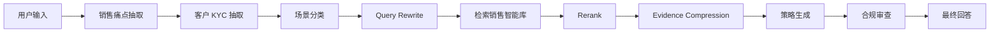

# Sales Intelligence Layer 销售实战智能层

销售采访语料不是普通 RAG 文档。它包含资深销售的隐性经验：怎么问 KYC、怎么破冰、怎么讲宏观、怎么举案例、怎么处理异议、怎么通过计划书推进成交。

## 这一层沉淀什么

- 原始访谈归档；
- 结构化销售洞察卡片；
- KYC 问题库；
- 破冰 / 宏观共鸣库；
- 案例与事实库；
- 异议处理库；
- 计划书 / 成交 Playbook；
- 话术模板库；
- 销售能力模型；
- Eval Case Generator。

## 为什么不是普通 RAG

普通 RAG 只是“查资料”。Sales Intelligence Layer 要做的是：

1. 把一线经验结构化；
2. 给每条经验标注场景、客户类型、风险等级和适用条件；
3. 高风险话术不能进入生成；
4. 检索结果要压缩成 digest；
5. 能反向生成 eval case。

## 卡片 Schema

核心 schema：

- `src/agent_core/sales_intelligence/schemas.py`
- `src/agent_core/sales_intelligence/sales_insight_card.schema.json`

## 检索链路

## 面试讲法

可以这样讲：

> 这层不是知识库，而是把一线销售经验变成可检索、可审查、可评估、可追溯的业务资产。

