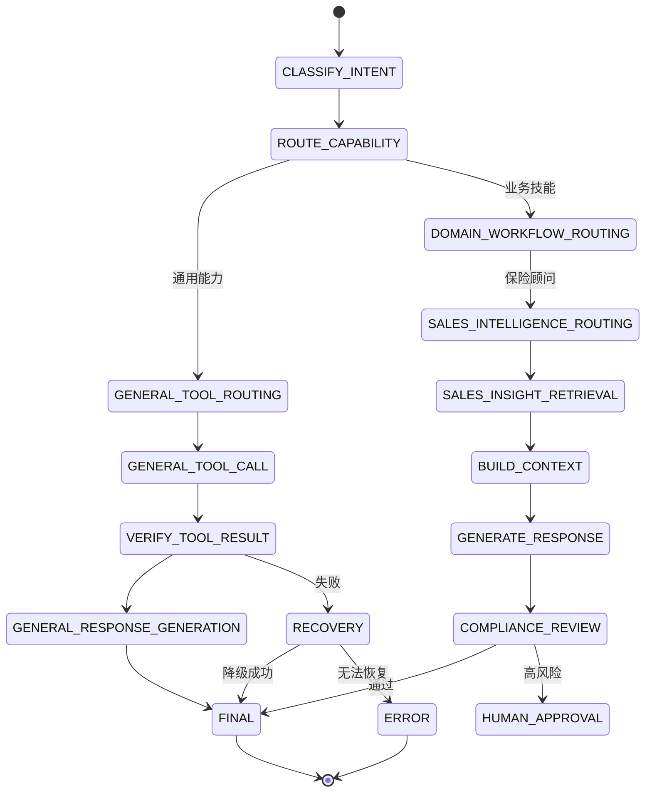

# 状态机设计

项目使用显式状态机，而不是让大模型自由决定流程。

## 当前实现

- 状态枚举：`src/agent_core/graph/state.py`
- 节点函数：`src/agent_core/graph/nodes.py`
- 图构建：`src/agent_core/graph/builder.py`

每次 `move_to()` 都会记录结构化状态迁移，并进入本地日志。

