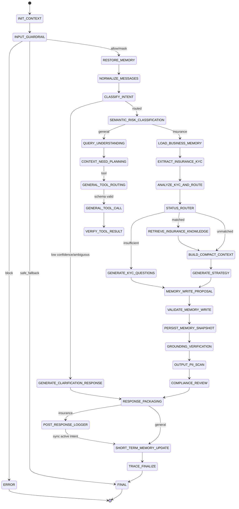

# 状态机设计

向量召回和 LLM 裁定是 `CLASSIFY_INTENT` 内可观测子阶段，通过 Trace 记录 source、TopK 分数、
confidence 和 dispatch action。客户槽位值不进入 Trace。

保险分支刻意在生成追问/策略之后才创建并持久化 `MemoryWriteProposal`。因此只有实际返回给客户的
`presented_kyc_focus` 才会成为已问记录；如果生成失败，不会提前消耗补问轮次。

状态定义在 `graph/state.py`，节点在 `graph/nodes.py`，顺序在 `graph/builder.py`。所有切换必须经过
`move_to()`。
